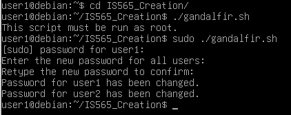

# IS565_Creation

The purpose of this script is to set temporary passwords for all users on a machine.

Our vision for the code is to make a scipted response to incidents regarding compromised accounts.

Script Description:

The Bash script is designed for unanimously changing the passwords of user accounts on a Unix-like system by providing a straightforward, logical, interactive flow for all non-system users. Below is an explanation of how the script works:

## Check if the script is run as root

```bash
if [ "$EUID" -ne 0 ]; then
  echo "This script must be run as root."
  exit 1
fi
```

The script starts by checking whether it is being executed with root (superuser) privileges. It verifies this by examining the effective user ID ($EUID).

If the script is not run as root, it displays an error message and exits with an exit code of 1, indicating an unsuccessful execution.

## Function to change all user passwords

```bash
change_all_passwords() {
  local new_password="$1"

  user_list=$(awk -F: '$3 >= 1000 && $1 != "nobody" {print $1}' /etc/passwd)

  for user in $user_list; do
    echo "$user:$new_password" | chpasswd
    echo "Password for $user has been changed."
  done
}
```

The change_all_passwords function is responsible for changing the passwords for all non-system user accounts to a specified password. It uses the awk command to extract a list of non-system users from the /etc/passwd file, and then iterates through the list, setting the new password for each user.

## Running the script

The following code runs when the script is executed and is responsible for the work done:

```bash
# Ask the user for the new password
echo -n "Enter the new password for all users: "
read -s new_password
echo

# Ask the user to confirm the password
echo -n "Retype the new password to confirm: "
read -s confirm_password
echo

if [ "$new_password" != "$confirm_password" ]; then
  echo "Passwords do not match. Passwords were not changed."
  exit 1
else
  # Call the function to change all user passwords
  change_all_passwords "$new_password"
fi
```

When the entire sript runs, it will look something like the following:



## Getting Started

Before running this script, please ensure that you have a backup or fall-out plan for re-provisioning users and that you've considered the security implications of using a common password for all users.

To use the script, follow these steps:

1. Open a terminal as the root user or use the sudo command to run the script with root privileges.
2. Execute the script and provide the new password when prompted.
3. Confirm the new password by retyping it.
4. The script will change the passwords for all non-system user accounts to the specified password.

In summary, this script simplifies the process of changing passwords for multiple user accounts, ensuring that it is executed with root privileges and providing a straightforward, logical, and secure approach to password management.
