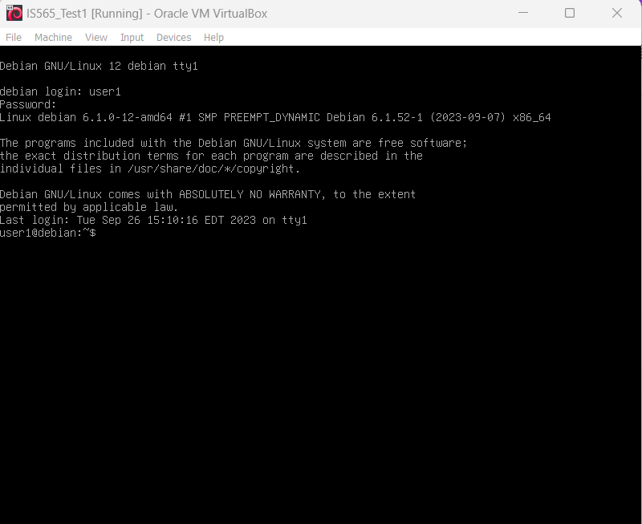

# IS565_Creation

The purpose of this script is to set temporary passwords for all users on a machine. 

Our vision for the code is to make a scipted response to incidents regarding compromised accounts.

Script Description:

The Bash script is designed for unanimously changing the passwords of user accounts on a Unix-like system by providing a straightforward, logical, interactive flow for all non-system users. Below is an explanation of how the script works:

# Check if the script is run as root
```bash
if [ "$EUID" -ne 0 ]; then
  echo "This script must be run as root."
  exit 1
fi
```

The script starts by checking whether it is being executed with root (superuser) privileges. It verifies this by examining the effective user ID ($EUID).

If the script is not run as root, it displays an error message and exits with an exit code of 1, indicating an unsuccessful execution.

# Function to change all passwords
This script function, unlike the other functionalities, will change all passwords at once without having to specify each user individually or loop through.

# Function to change a user's password
```
change_password() {
  local user="$1"
  echo -n "Enter the new password for $user: "
  read -s password
  echo
  echo -n "Retype the new password for $user: "
  read -s password2
  echo

  if [ "$password" != "$password2" ]; then
    echo "Passwords do not match. Password not changed."
  else
    echo "$user:$password" | chpasswd
    echo "Password for $user has been changed."
  fi
}
```
This is a function definition for change_password that will be used to change a user's password interactively. It prompts the administrator to enter a new password twice (for confirmation), and then checks if the entered passwords match. If the passwords match, it uses the chpasswd command to change the user's password and provides a success message. If the passwords do not match, it displays an error message.

When the entire sript runs, it will look something like the following:


# Get a list of all user accounts (excluding system users)
```
user_list=$(awk -F: '$3 >= 1000 && $1 != "nobody" {print $1}' /etc/passwd)
```
This line uses the awk command to extract a list of user accounts from the /etc/passwd file.
It filters out system users (UID less than 1000) and ensures that the "nobody" user is not included in the list. The resulting list of non-system user accounts is stored in the user_list variable.

# Loop through each user and change their password
```
for user in $user_list; do
  change_password "$user"
done
```
This loop iterates through each user in the user_list.



Note: before executing this script, be sure that you have a fall-out plan for re-provisioning users and locking out identified threat actors.

For each user, it calls the change_password function, passing the username as an argument.
The change_password function then handles the password change process for each user.

In summary, this script ensures that it is executed with root privileges, extracts a list of non-system user accounts from /etc/passwd, and then uses a function to interactively change the password for each user in the list.
